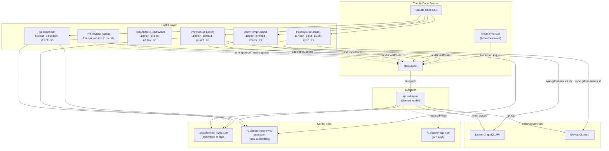
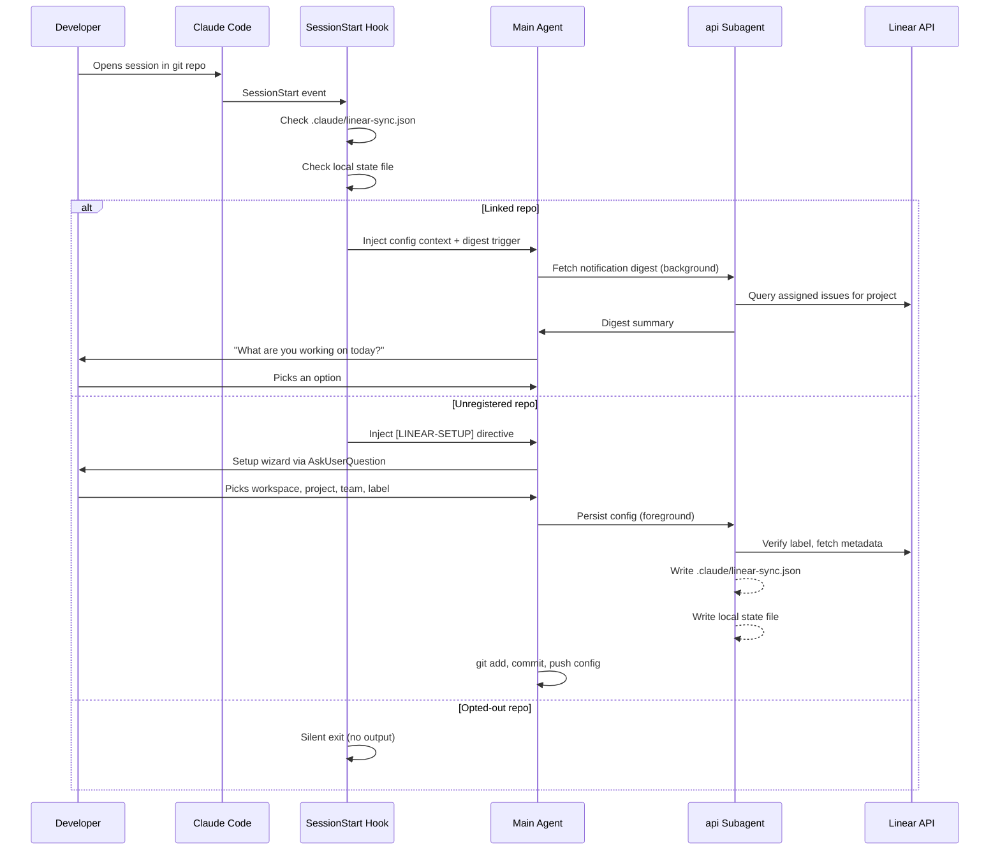
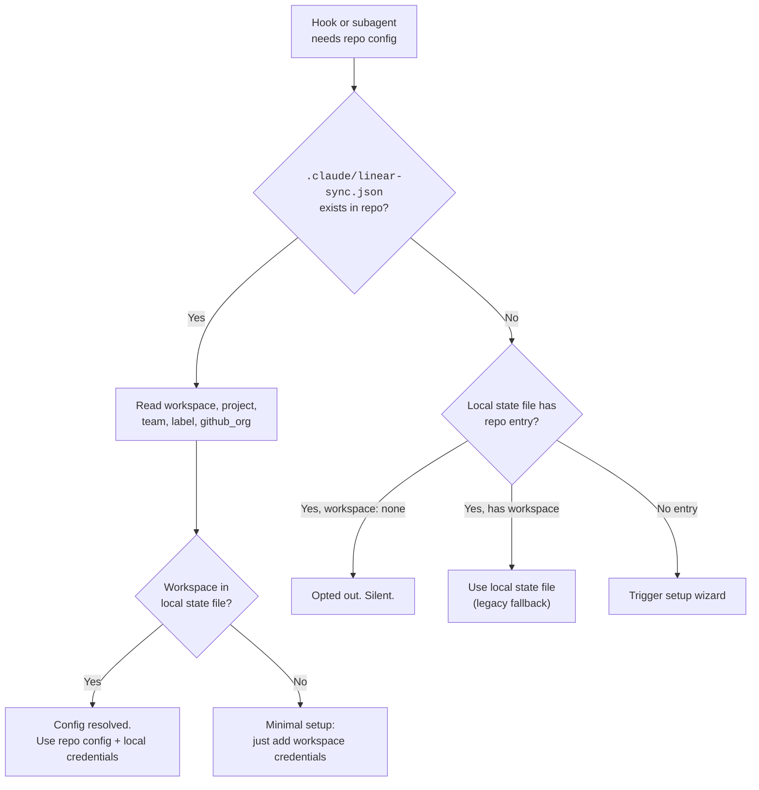
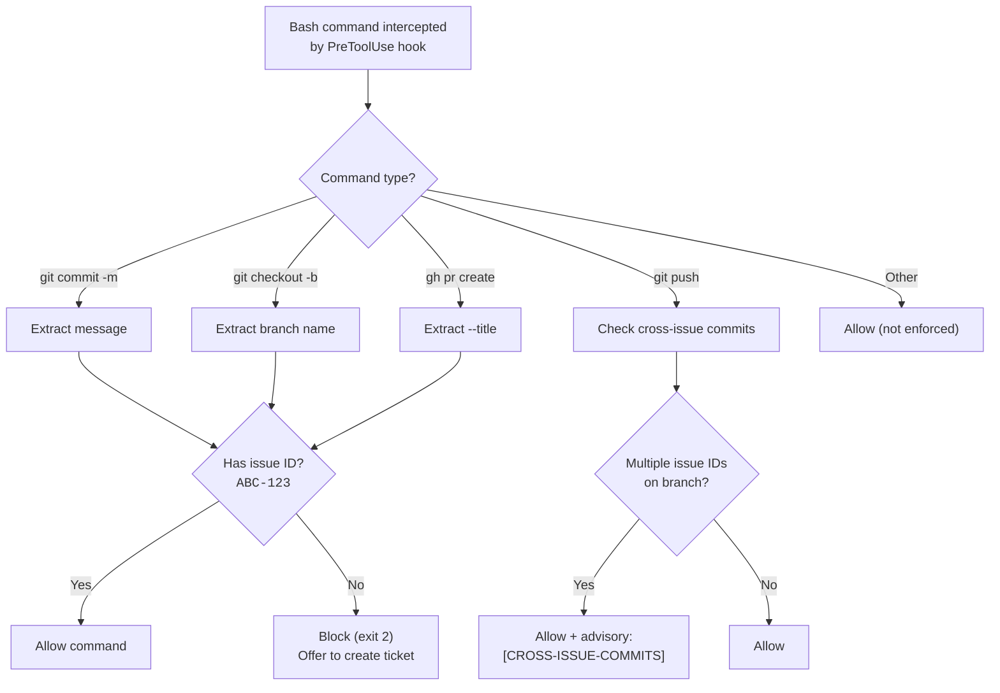
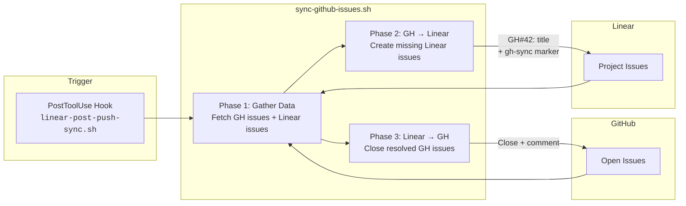
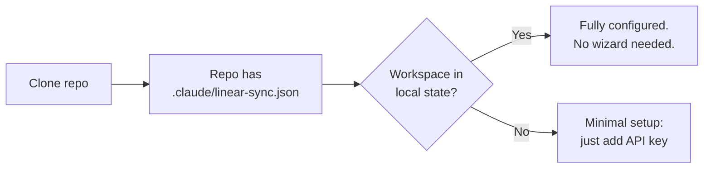

# Linear Sync

> **Alpha** — This plugin is under active development. Expect rough edges, breaking changes, and incomplete docs. Feedback and issues welcome at [crystal-peak/linear-sync](https://github.com/crystal-peak/linear-sync/issues).

A Claude Code plugin that keeps [Linear](https://linear.app) and GitHub in sync. Automatic issue tracking, branch naming, commit enforcement, PR descriptions, GitHub issue sync, and progress updates — all through natural conversation.

Install via `claude plugin install linear-sync@crystal-peak` (after adding the [Crystal Peak marketplace](https://github.com/crystal-peak/claude-plugins)).

## How It Works

Linear Sync registers hooks, a subagent, a skill, and scripts via the Claude Code plugin system. When you open Claude Code in any git repo, it detects whether the repo is linked to Linear and adapts accordingly.



## Architecture

### Component Overview

| Component | File | Purpose |
|-----------|------|---------|
| **Session Start Hook** | `hooks/scripts/linear-session-start.sh` | Detects repo, resolves config, injects context at session start |
| **Commit Guard Hook** | `hooks/scripts/linear-commit-guard.sh` | Enforces issue IDs in commits, branches, PRs; cross-issue warnings |
| **Prompt Check Hook** | `hooks/scripts/linear-prompt-check.sh` | Detects issue ID mentions in dev prompts, triggers background fetch |
| **Post-Push Sync Hook** | `hooks/scripts/linear-post-push-sync.sh` | Runs GitHub sync after `git push` / `gh pr create`, injects comment reminder |
| **API Auto-Approve Hook** | `hooks/scripts/linear-api-allow.sh` | Auto-approves `bash linear-api.sh` commands (prevents permission prompts) |
| **State Auto-Approve Hook** | `hooks/scripts/linear-state-allow.sh` | Auto-approves Read/Write on state file and plugin paths |
| **Subagent** | `agents/api.md` | Handles Linear API queries, state persistence, config setup |
| **Skill** | `skills/linear-sync/SKILL.md` | Behavioral instructions loaded by the main agent on trigger |
| **API Wrapper** | `scripts/linear-api.sh` | Reads API key from mcp.json, calls Linear GraphQL API |
| **GitHub Sync Script** | `scripts/sync-github-issues.sh` | Bidirectional sync between GitHub Issues and Linear |
| **Hook Config** | `hooks/hooks.json` | Registers all hooks with Claude Code plugin system |
| **JSON Schema** | `schema/linear-sync.json` | Schema for the committed repo config file |

### Session Lifecycle



### Config Resolution

Two levels of config, with the committed repo file taking priority:



**What lives where:**

| Setting | Location | Why |
|---------|----------|-----|
| Workspace, project, team, label, github_org | **Repo** (`.claude/linear-sync.json`) | Shared truth — committed, all devs agree |
| API key routing, cache, last_issue | **Local** (`~/.claude/linear-sync/state.json`) | Per-user credentials and session state |
| API keys | **Local** (`~/.claude/mcp.json`) | Secrets, never committed |

### Commit Guard Flow



### GitHub Issue Sync

Bidirectional sync between GitHub Issues and Linear. Runs automatically via the PostToolUse hook after `git push` or `gh pr create` in linked repos.



**Duplicate detection:** Each synced Linear issue contains an invisible marker in its description:
```
<!-- gh-sync:org/repo#42 -->
```
On subsequent syncs, this marker prevents duplicate creation.

### Subagent Task Map

The `api` subagent handles Linear API queries via `linear-api.sh`. The main agent handles simple mutations directly via MCP tools.

```mermaid
flowchart TD
    subgraph "Setup & Config"
        LINK["Link Repo to Project"]
        SETUP_WS["Set Up New Workspace"]
        OPT_OUT["Opt Repo Out"]
    end

    subgraph "Issue Management"
        CREATE["Create Issue"]
        FETCH["Fetch Issue Summary"]
        FETCH_REL["Fetch Issue with Relations"]
        SEARCH["Search Issues<br/>(duplicate detection)"]
        ASSIGN["Assign Issue to Viewer"]
        MY_ISSUES["Fetch My Issues"]
    end

    subgraph "Workflow"
        COMMENT["Post Comment on Issue"]
        CYCLE_FETCH["Fetch Active Cycle"]
        CYCLE_ADD["Add Issue to Cycle"]
        SAVE_LAST["Save Last Issue"]
        DIGEST["Fetch Notification Digest"]
        CLOSED_NO_PR["Check Closed Issues<br/>Without PRs"]
    end

    subgraph "Sync & Cache"
        GH_SYNC["Sync GitHub Issues"]
        CACHE["Update Cache"]
        LABEL["Verify/Create Label"]
    end
```



## Features

### Session Start
- Notification digest scoped to current repo's project and label
- Stale branch warnings (5+ days without commits)
- Resume last issue or pick a new one
- Setup wizard for first-time repos (committed config auto-pushed)

### Issue Tracking
- Create issues from natural language descriptions
- Duplicate detection before creation
- Priority inference from keywords (urgent, bug, chore, etc.)
- Cycle/sprint auto-assignment
- Blocking issue warnings
- Auto-assign unassigned issues when picked

### Git Enforcement
- Issue ID required in commit messages (`OPL-123: description`)
- Issue ID required in branch names (`user/OPL-123-slug`)
- Issue ID required in PR titles
- Auto-generated branch names from issue title
- Cross-issue commit advisory on push

### PR & Progress
- Auto-drafted PR body from issue context and commit history
- Progress comment drafts at natural stopping points (PR creation, push, session end)
- All comments shown to dev for approval before posting

### GitHub Issue Sync
- Open GitHub issues create corresponding Linear issues
- Closed Linear issues close their linked GitHub issues
- Marker-based duplicate prevention
- On-demand via session menu

### Context Conservation
- Main agent delegates queries to subagent via `linear-api.sh`, handles simple mutations via direct MCP calls
- Subagent runs on Sonnet for reliable instruction-following
- Background mode for non-blocking operations
- Workspace metadata cached with 24h TTL
- Hooks inject minimal context strings, not raw API data

## Installation

### Prerequisites

- [Claude Code](https://claude.com/claude-code) CLI
- Python 3 (`python3` in PATH)
- `curl`
- Node.js / npx (for the Linear MCP server)
- GitHub CLI (`gh`) — optional, required for GitHub Issue Sync
- A Linear API key ([create one here](https://linear.app/settings/api))

### Install via Plugin (Recommended)

Add the Crystal Peak marketplace (one-time):

```bash
claude plugin marketplace add crystal-peak/claude-plugins
```

Install the plugin:

```bash
claude plugin install linear-sync@crystal-peak
```

Update to the latest version:

```bash
claude plugin marketplace update crystal-peak       # pull latest registry
claude plugin update linear-sync@crystal-peak        # update the plugin
```

Restart Claude Code after installing or updating for changes to take effect.

The plugin system handles hook registration, agent loading, skill activation, and script paths automatically.

### Install Standalone (Alternative)

For use without the plugin system:

```bash
git clone https://github.com/crystal-peak/linear-sync.git
cd linear-sync
bash install.sh
```

The standalone installer copies hooks, the subagent, and scripts to `~/.claude/` and merges hook config into `~/.claude/settings.json`. It is idempotent — safe to re-run.

> **Note:** The standalone installer does not include the PostToolUse hook (`linear-post-push-sync.sh`), auto-approve hooks (`linear-api-allow.sh`, `linear-state-allow.sh`), or the skill file. These are plugin-only.

### Configure Linear MCP

Add your Linear API key to `~/.claude/mcp.json`:

```json
{
  "mcpServers": {
    "linear": {
      "type": "stdio",
      "command": "npx",
      "args": ["-y", "@anthropic/linear-mcp-server"],
      "env": {
        "LINEAR_API_KEY": "<your-linear-api-key>"
      }
    }
  }
}
```

For multiple workspaces, add one entry per workspace:

```json
{
  "mcpServers": {
    "linear-opl": {
      "type": "stdio",
      "command": "npx",
      "args": ["-y", "@anthropic/linear-mcp-server"],
      "env": { "LINEAR_API_KEY": "<opl-key>" }
    },
    "linear-crystalpeak": {
      "type": "stdio",
      "command": "npx",
      "args": ["-y", "@anthropic/linear-mcp-server"],
      "env": { "LINEAR_API_KEY": "<crystalpeak-key>" }
    }
  }
}
```

### First Run

1. Open Claude Code in any git repo
2. The session-start hook detects the repo and walks you through setup
3. Pick your workspace, project, and team from presented options
4. The config file (`.claude/linear-sync.json`) is committed and pushed automatically
5. Every subsequent session starts with "What are you working on today?"

### Second Developer Experience

When another developer clones a repo that already has `.claude/linear-sync.json`:



No project/team/label questions — they come from the committed config.

## File Structure

### Plugin Layout

```
linear-sync/                           # Plugin root
├── .claude-plugin/plugin.json         # Plugin manifest
├── agents/
│   └── api.md                         # Subagent definition
├── skills/
│   └── linear-sync/
│       └── SKILL.md                   # Behavioral instructions (loaded on trigger)
├── hooks/
│   ├── hooks.json                     # Hook registration (all 6 hooks)
│   └── scripts/
│       ├── linear-session-start.sh    # SessionStart hook
│       ├── linear-commit-guard.sh     # PreToolUse hook (Bash) — commit/branch/PR enforcement
│       ├── linear-prompt-check.sh     # UserPromptSubmit hook — issue reference injection
│       ├── linear-post-push-sync.sh   # PostToolUse hook (Bash) — GitHub sync + comment reminder
│       ├── linear-api-allow.sh        # PreToolUse hook (Bash) — auto-approve linear-api.sh calls
│       └── linear-state-allow.sh      # PreToolUse hook (Read|Write) — auto-approve state file access
├── scripts/
│   ├── linear-api.sh                  # Linear GraphQL API wrapper
│   └── sync-github-issues.sh          # Bidirectional GitHub ↔ Linear sync
└── schema/
    └── linear-sync.json               # JSON Schema for repo config
```

### Development Repo (this repo)

```
linear-sync/
├── README.md                  # This file
├── SETUP.md                   # Detailed setup guide
├── GITHUB-ISSUE-SYNC-SPEC.md  # GitHub sync design spec
├── linear-sync-build-spec.md  # Build specification
├── install.sh                 # Standalone installer (alternative to plugin)
├── settings.json              # Standalone hook registration config
├── CLAUDE-snippet.md          # Standalone behavioral instructions
├── schema/
│   └── linear-sync.json       # JSON Schema for repo config
├── agents/
│   └── api.md                 # Subagent definition
├── hooks/
│   ├── hooks.json             # Hook registration
│   └── scripts/
│       ├── linear-session-start.sh
│       ├── linear-commit-guard.sh
│       ├── linear-prompt-check.sh
│       ├── linear-post-push-sync.sh
│       ├── linear-api-allow.sh
│       └── linear-state-allow.sh
└── scripts/
    ├── linear-api.sh
    ├── sync-github-issues.sh
    └── linear-repo-links.json # State file template
```

### Runtime State

```
~/.claude/
├── mcp.json                          # Your API keys (manual setup)
└── linear-sync/
    └── state.json                    # Local credentials, cache, per-repo state
```

### In Each Linked Repo

```
your-repo/
└── .claude/
    └── linear-sync.json              # Committed shared config
```

## Repo Config Schema

The `.claude/linear-sync.json` file committed to each repo:

```json
{
  "$schema": "https://raw.githubusercontent.com/crystal-peak/linear-sync/main/schema/linear-sync.json",
  "_warning": "AUTO-MANAGED by linear-sync. Manual edits may break issue sync.",
  "workspace": "crystalpeak",
  "project": "My Project",
  "team": "PEAK",
  "label": "repo:my-repo",
  "github_org": "crystal-peak"
}
```

| Field | Required | Description |
|-------|----------|-------------|
| `workspace` | Yes | Linear workspace identifier (matches local state file for credential routing) |
| `team` | Yes | Team key (e.g., `OPL`, `ENG`). Used as issue ID prefix. Pattern: `^[A-Z]{2,5}$` |
| `project` | No | Linear project name this repo is linked to |
| `label` | No | Label applied to issues from this repo (e.g., `repo:my-repo`) |
| `github_org` | No | GitHub org/owner for this repo |

## Team Config Templates

For teams with shared conventions, commit a `.linear-sync-template.json` to the repo root:

```json
{
  "workspace": "crystalpeak",
  "project": "Project Atlas",
  "team": "PEAK",
  "label": "repo:my-repo"
}
```

When a dev opens Claude Code in a repo with this template, the setup wizard pre-fills from it and asks for confirmation.

## Opting Out

During setup, pick "This repo doesn't use Linear." All hooks go silent for that repo — zero overhead.

To opt out after setup, delete the repo entry from `~/.claude/linear-sync/state.json` or set its workspace to `"none"`.

## Troubleshooting

**Hooks not firing?** Run `claude plugin marketplace update crystal-peak && claude plugin update linear-sync@crystal-peak` then restart Claude Code. For standalone installs, verify `~/.claude/settings.json` has the hook entries and re-run `bash install.sh`.

**"python3 not found"?** Install Python 3 and ensure `python3` is in your PATH.

**Re-link a repo?** Delete `.claude/linear-sync.json` from the repo, remove the repo entry from `~/.claude/linear-sync/state.json`, and restart Claude Code.

**Uninstall (plugin)?** Run `claude plugin uninstall linear-sync@crystal-peak`.

**Uninstall (standalone)?** Remove hook files from `~/.claude/hooks/`, the agent from `~/.claude/agents/api.md`, and the `Linear Sync (Auto-Managed)` section from `~/.claude/CLAUDE.md`.

## License

MIT
